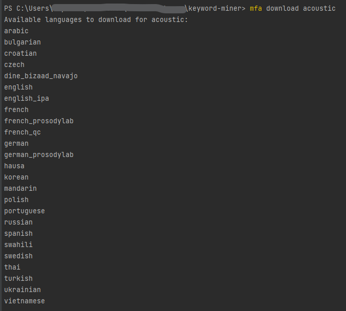

# Welcome to Keyword Miner!

This repository contains the source code of the open-source framework **Keyword Miner**. Given an input dataset of transcribed speech, this framework applies forced alignment methods to output labeled single-spoken keywords, which can be used to train and evaluate keyword spotters. KeywordMiner has been developed as part of a project executed by [SiDi](https://www.sidi.org.br) and financed by Samsung Eletrônica da Amazonia Ltda., under the auspices of the Brazilian Federal Law of Informatics nº. 8248/91.

> **Note**: Due to a standard procedure, the source code of KeywordMiner is currently under review by Samsung, and **once approved** it will be immediately shared in this GitHub repository.

# Overview

The goal of KeywordMiner is to generate a dataset of single-spoken keywords segmented from transcribed speech recordings. It relies on [MFA](https://github.com/MontrealCorpusTools/Montreal-Forced-Aligner), a popular open-source forced aligner, to align the transcript text to the recorded speech and then segment those recordings into labeled audio clips of single keywords giving the start and end times of each word. 

KeywordMiner supports many languages and dialects. It also can be easily extended to support as input popular public datasets of transcribed speech. Hence, it has the potential to boost the development of new datasets for keyword spotting.

## Specifications

- **Input datasets**: by default, any dataset of transcribed speech that has the same structure as LibriSpeech or Mozilla Common Voice*.
- **Supported languages**: any language supported by MFA, as prompted on [this list](#language-id).
- **input audio file format**: any format is supported since the input files are converted to *.wav* format.

> **Note**: KeywordMiner can be easily extended to support datasets with any structure besides those from LibriSpeech or Mozilla Common Voice.

## How to use

-  [optional] Create a virtual environment using some tool of your choice (*e.g.*, **conda** or **pip-env**)
-  [optional] Activate the previous virtual environment
- Install the requirements: `pip install -r requirements.txt --upgrade`
- Install pretrained acoustic models as [specified by MFA](https://montreal-forced-aligner.readthedocs.io/en/latest/pretrained_models.html#pretrained-models): `mfa download acoustic <language_id>`
-  [optional] Validate alignment setup: `mfa validate <corpus_directory> <dictionary_path> <[optional_acoustic_model_path]>`
- Run the main script: `python main.py`

The validation step aims to help the developer determine the success of the installation, but it is not a part of the setup process.

### Language ID
If no language ID is passed as an argument, a list of available IDs will be prompted, as shown in the screenshot below:



When installing a pre-trained model, one of the IDs must be provided according to the intended language or preferred alternative model to be used.  For example, for a model trained in English, one could use: `mfa download acoustic english`

## System design
### Folders
This project is structured as follows:
```
root/
└── datasets/
└── inputs/
    ├── configs/
    └── lexicons/
└── source/
```
Those folders have the following properties:
- **datasets/**: holds the interfaces that model the structure of the input datasets.
- **inputs/configs/**: stores the configuration files used by this project.
- **inputs/lexicons/**: contains the pronunciation dictionaries for each language.
- **source/**: holds this project's main source code.

> **Note:** This project also creates a local directory named ***outputs***, which is listed in file ***.gitignore***. That directory's subfolders hold the outputs of this project (*i.e.*, segmented audio files).

### Entities
Currently, this project considers three main entities: TranscribedDataset, Aligner, Segmenter. All of them are shortly described below:

- **TranscribedDataset**: represents an interface between KeywordMiner and any input dataset of transcribed speech.
- **Aligner**: aligns the input speech recordings to their respective transcripts.
- **Segmenter**: uses the alignment info to segment the input speech recordings into single-spoken keywords.

# Guidelines for Developers

The following are the development guidelines considered in this open-source project. If you want to contribute to this project, please try to follow these guidelines the best you can. The quality of KeywordMiner depends on you! 😊

## Branches

This repository has the following branches:

-  **main:** the branch that keeps only tested production code.
-  **dev:** used by developers to integrate and share their local code.
- **feature\_*\<name\>***: local branch created by each developer to implement a new feature.

>  **Note:** The expected development workflows are **feature\_*\<name\>*** -> **dev** -> **main**.

## Commits

To keep the commits easy to understand, please keep their messages short and concise (*e.g.*  `Added language attribute`, `Refactored segmenter` or `Improved comments on alignment methods`).  

## Documentation

This project considers the **Docstring Conventions** by [PEP257](https://confluence.sidi.org.br:8443/display/BBY/AI+RnD+-+Custom+Wake-Up) and follows its [Numpy's implementation](https://numpydoc.readthedocs.io/en/latest/format.html). Note that this project also follows the *best practices for Software Engineering* (*e.g.*, [Clean Code](https://www.amazon.com/Clean-Code-Handbook-Software-Craftsmanship-ebook-dp-B001GSTOAM/dp/B001GSTOAM/ref=mt_other?_encoding=UTF8&me=&qid=)), it must document only public classes and methods. It is up to each developer to decide whether or not to document private artifacts.
  

# Support

If you have any questions about this project, please contact one of the following original authors:
 
|Name            |Email                        |
|----------------|-----------------------------|
|Michel Meneses  |m.meneses@sidi.org.br        |
|Rafael Holanda  |r.holanda@sidi.org.br        |
|Luís Peres		   |l.peres@sidi.org.br    	     |
|Gabriela Rocha  |g.rocha@sidi.org.br          |
